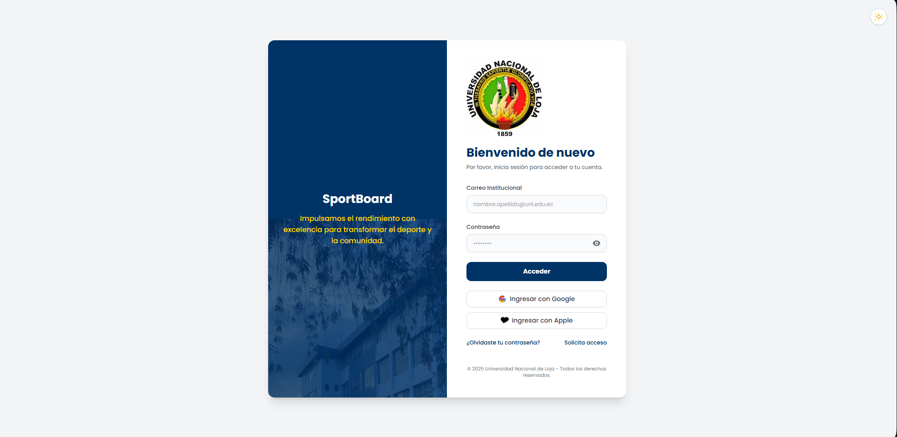
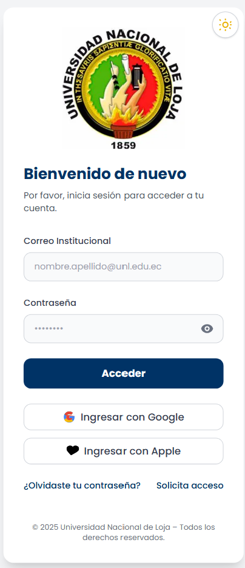
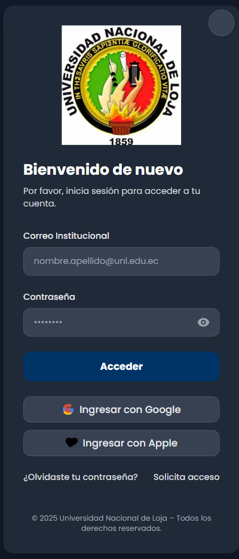
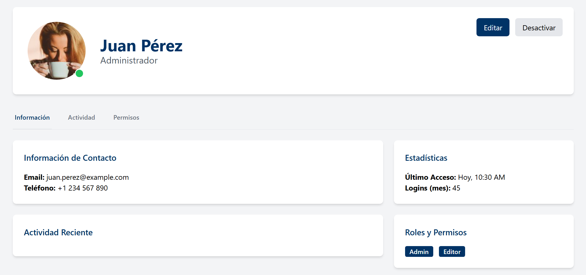
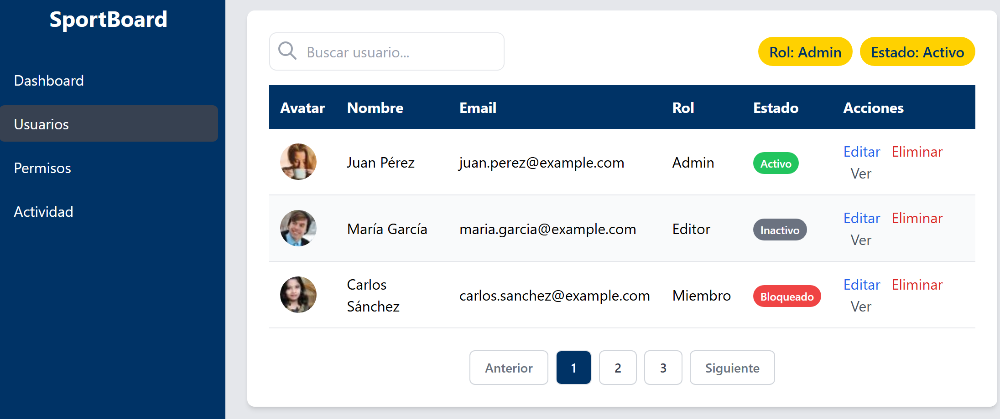
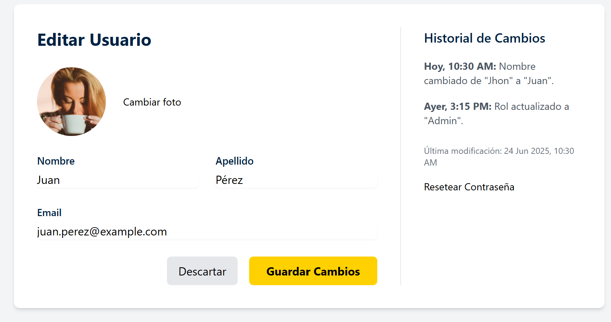
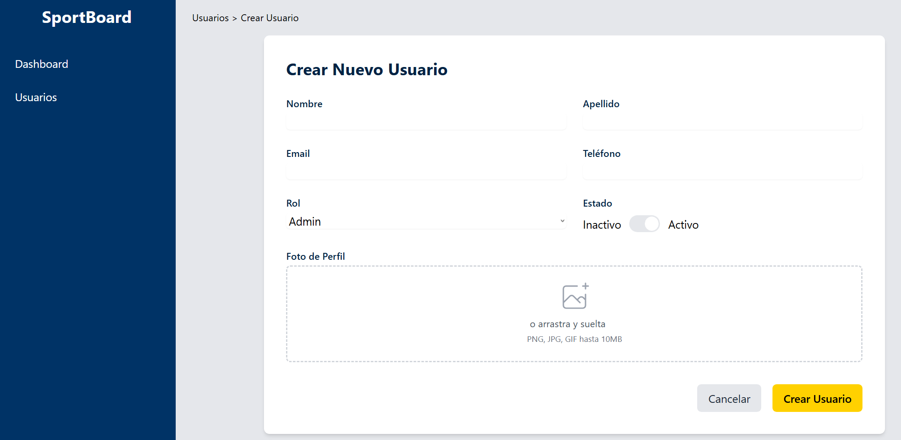

# APE-Login

Sistema de Login para SportBoard - Universidad Nacional de Loja


## Descripción

Este proyecto es una interfaz de inicio de sesión moderna y responsiva, desarrollada con HTML, Tailwind CSS y JavaScript. Permite a los usuarios acceder al sistema SportBoard de la Universidad Nacional de Loja.

## Estructura del Proyecto

- `index.html`: Página principal de login.
- `css/styles.css`: Estilos personalizados.
- `js/main.js`: Lógica para mostrar/ocultar contraseña.
- `images/`: Imágenes utilizadas en la interfaz (logo y campus).
- `tailwind.config.js`: Configuración de Tailwind CSS.

## Requisitos

- Navegador web moderno (Chrome, Firefox, Edge, etc.)
- No requiere instalación de dependencias ni servidor backend para la vista.

## Instrucciones de Uso

1. **Clona el repositorio:**
   ```sh
   git clone <URL_DEL_REPOSITORIO>
   ```
2. **Accede a la carpeta del proyecto:**
   ```sh
   cd APE-Login
   ```
3. **Abre el archivo `index.html` en tu navegador:**
   - Haz doble clic en `index.html` o ábrelo desde tu navegador preferido.

## Estructura de Carpetas

```
APE-Login/
│   index.html
│   README.md
│   tailwind.config.js
│
├───css/
│       styles.css
│
├───images/
│       campus.avif
│       campus.jpeg
│       campus.webp
│       logo.avif
│       logo.jpeg
│       logo.webp
│
└───js/
        main.js
```

## Personalización
- Puedes cambiar las imágenes en la carpeta `images/` para personalizar el logo o el fondo.
- Modifica los estilos en `css/styles.css` o la configuración de Tailwind en `tailwind.config.js` según tus necesidades.

## Notas
- Para limpiar la caché del navegador, usa `Ctrl+F5`.

## Créditos
Desarrollado por Joseph Balcázar Loaiza.


Desarrollado por la Universidad Nacional de Loja.

## Vistas de la Aplicación

A continuación se muestran capturas de pantalla de la interfaz en diferentes dispositivos y vistas:

- 
- 
- 
- 
## Vistas del Módulo de Usuarios

| Dashboard | Lista de Usuarios |
| :---: | :---: |
|  |  |

| Creación de Usuario | Perfil de Usuario |
| :---: | :---: |
|  |  |
# APE-Login - Módulo de Autenticación y Gestión de Usuarios

Este proyecto consiste en una interfaz de inicio de sesión moderna y un completo módulo de gestión de usuarios, diseñados con una estética limpia y profesional utilizando la paleta de colores de la Universidad Nacional de Loja (UNL).

## Características

### 1. Vista de Login
- Diseño responsive y atractivo.
- Campos para email y contraseña.
- Enlace para recuperar contraseña.
- Botón de inicio de sesión con efecto hover.
- Integración de logo institucional.

### 2. Módulo de Gestión de Usuarios (Nuevo)
Se ha añadido un completo panel para la administración de usuarios con las siguientes interfaces:

- **Dashboard Principal:** Métricas clave, gráficos de registros y actividad reciente.
- **Lista de Usuarios:** Búsqueda, filtros, paginación y acciones rápidas.
- **Creación y Edición de Usuarios:** Formularios intuitivos y funcionales.
- **Perfil de Usuario:** Vista detallada con información, actividad y permisos.
- **Gestión de Permisos:** Matriz de roles y permisos para un control granular.
- **Búsqueda Avanzada:** Filtros específicos para encontrar usuarios fácilmente.
- **Dashboard de Actividad:** Visualización de la actividad de los usuarios en la plataforma.
- **Modales de Confirmación:** Para acciones críticas como la eliminación de usuarios.
- **Configuración de Notificaciones:** Gestión de las notificaciones que reciben los usuarios.


## Tecnologías Utilizadas
- **HTML5:** Para la estructura semántica.
- **Tailwind CSS:** Para un diseño rápido y responsive.
- **JavaScript:** Para la interactividad y la lógica de la interfaz.
- **Chart.js:** Para la creación de gráficos dinámicos.

## Instalación y Uso

1. Clona el repositorio:
   ```bash
   git clone https://github.com/tu-usuario/APE-Login.git
   ```
2. Navega al directorio del proyecto:
   ```bash
   cd APE-Login
   ```
3. Abre el archivo `index.html` en tu navegador para ver la página de login o navega a la carpeta `user_module` para explorar las nuevas interfaces.
