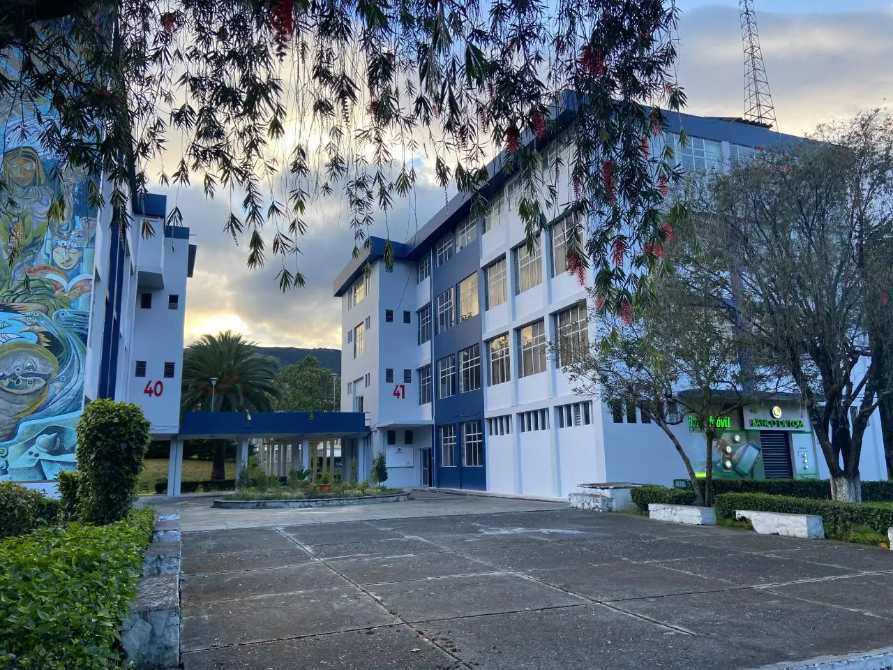

# APE-Login


Sistema de Login para SportBoard - Universidad Nacional de Loja


## Descripción

Este proyecto es una interfaz de inicio de sesión moderna y responsiva, desarrollada con HTML, Tailwind CSS y JavaScript. Permite a los usuarios acceder al sistema SportBoard de la Universidad Nacional de Loja.

## Estructura del Proyecto

- `index.html`: Página principal de login.
- `css/styles.css`: Estilos personalizados.
- `js/main.js`: Lógica para mostrar/ocultar contraseña.
- `images/`: Imágenes utilizadas en la interfaz (logo y campus).
- `tailwind.config.js`: Configuración de Tailwind CSS.

## Requisitos

- Navegador web moderno (Chrome, Firefox, Edge, etc.)
- No requiere instalación de dependencias ni servidor backend para la vista.

## Instrucciones de Uso

1. **Clona el repositorio:**
   ```sh
   git clone <URL_DEL_REPOSITORIO>
   ```
2. **Accede a la carpeta del proyecto:**
   ```sh
   cd APE-Login
   ```
3. **Abre el archivo `index.html` en tu navegador:**
   - Haz doble clic en `index.html` o ábrelo desde tu navegador preferido.

## Estructura de Carpetas

```
APE-Login/
│   index.html
│   README.md
│   tailwind.config.js
│
├───css/
│       styles.css
│
├───images/
│       campus.avif
│       campus.jpeg
│       campus.webp
│       imagen1_vistacompu.png
│       imagen2_vistacompuoscuro.png
│       imagen3_vistacelu.png
│       imagen4_vistaceluoscuro.png
│       interfaz1.png
│       Interfaz2.png
│       Interfaz3.png
│       Interfaz4.png
│       logo.avif
│       logo.jpeg
│       logo.webp
│
├───js/
│       main.js
│
└───user_module/
        activity_dashboard.html
        advanced_search.html
        create_user.html
        dashboard.html
        delete_user_modal.html
        edit_user.html
        notification_settings.html
        permissions.html
        user_list.html
        user_profile.html
```

## Tecnologías Utilizadas
- **HTML5:** Para la estructura semántica.
- **Tailwind CSS:** Para un diseño rápido y responsive.
- **JavaScript:** Para la interactividad y la lógica de la interfaz.
- **Chart.js:** Para la creación de gráficos dinámicos en el módulo de usuarios.

## Instalación y Uso

1. Clona el repositorio:
   ```bash
   git clone https://github.com/jcbastianl/Tarea.git
   ```
2. Navega al directorio del proyecto:
   ```bash
   cd APE-Login
   ```
3. Abre el archivo `index.html` en tu navegador para ver la página de login o navega a la carpeta `user_module` para explorar las interfaces del módulo de usuarios.

## Archivos del Módulo de Usuarios

El módulo de usuarios incluye las siguientes páginas:

- `dashboard.html` - Dashboard principal con métricas y gráficos
- `user_list.html` - Lista completa de usuarios con filtros
- `create_user.html` - Formulario para crear nuevos usuarios
- `edit_user.html` - Formulario para editar usuarios existentes
- `user_profile.html` - Perfil detallado de usuario
- `permissions.html` - Gestión de roles y permisos
- `advanced_search.html` - Búsqueda avanzada de usuarios
- `activity_dashboard.html` - Dashboard de actividad de usuarios
- `delete_user_modal.html` - Modal de confirmación para eliminar usuarios
- `notification_settings.html` - Configuración de notificaciones

## Notas
- Para limpiar la caché del navegador, usa `Ctrl+F5`.

## Créditos
Desarrollado por Joseph Balcázar Loaiza.


Desarrollado por la Universidad Nacional de Loja.

## Vistas de la Aplicación

A continuación se muestran capturas de pantalla de la interfaz en diferentes dispositivos y vistas:

### Vista de Login en Computadora


### Vista de Login en Computadora - Modo Oscuro


### Vista de Login en Celular


### Vista de Login en Celular - Modo Oscuro


## Módulo de Gestión de Usuarios

Se ha añadido un completo panel para la administración de usuarios con las siguientes interfaces:

- **Dashboard Principal:** Métricas clave, gráficos de registros y actividad reciente.
- **Lista de Usuarios:** Búsqueda, filtros, paginación y acciones rápidas.
- **Creación y Edición de Usuarios:** Formularios intuitivos y funcionales.
- **Perfil de Usuario:** Vista detallada con información, actividad y permisos.
- **Gestión de Permisos:** Matriz de roles y permisos para un control granular.
- **Búsqueda Avanzada:** Filtros específicos para encontrar usuarios fácilmente.
- **Dashboard de Actividad:** Visualización de la actividad de los usuarios en la plataforma.
- **Modales de Confirmación:** Para acciones críticas como la eliminación de usuarios.
- **Configuración de Notificaciones:** Gestión de las notificaciones que reciben los usuarios.

### Dashboard Principal del Módulo de Usuarios


### Lista de Usuarios


### Creación de Usuario


### Perfil de Usuario


## Recursos Adicionales

### Logo UNL
El proyecto incluye el logo de la Universidad Nacional de Loja en múltiples formatos:
- 
-   
- 

### Imagen del Campus
Se incluyen imágenes del campus universitario:
- 
- 
- 

